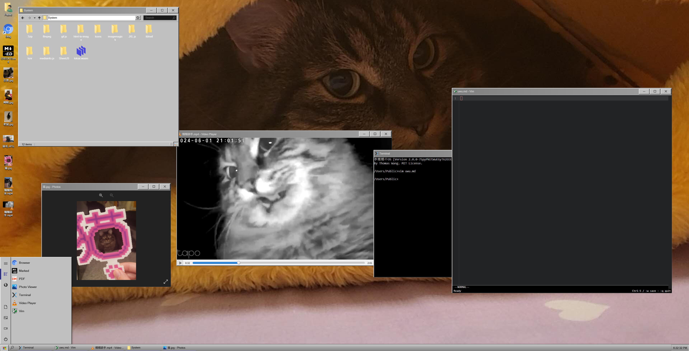

## Nuonuo OS

## _浏览器中的桌面环境_



> 本项目 Fork 自 [DustinBrett/daedalOS](https://github.com/DustinBrett/daedalOS) 并在其基础上修改而成:移除了重型应用与 AI 功能,换装 Win98 风格银色任务栏、斜角开始按钮与深蓝标题栏的经典皮肤。感谢原作者 [Dustin Brett](https://github.com/DustinBrett) 的开源贡献。
>
> 📖 如何使用与自定义本项目(例如:如何添加文件使其显示在桌面/文件管理器、创建快捷方式、更换图标、添加新应用等),参见 [USAGE.md](USAGE.md)。
>
> 🧩 完整的系统能力与应用列表参见 [FEATURES.md](FEATURES.md)。

# 架构 🏗️

## 运行时分层

- **应用外壳**：Next.js Pages Router 入口在 `pages/_app.tsx` 中按顺序挂载 Viewport、Language、Process、FileSystem、Session 和 Menu Provider；`pages/index.tsx` 组合桌面、任务栏与应用加载器。
- **进程模型**：`contexts/process/directory.ts` 是应用注册表，声明动态导入的组件、默认尺寸、图标、运行库和标题；Process Context 负责启动、关闭、焦点和窗口生命周期。
- **文件系统**：ZenFS 提供浏览器端文件抽象，静态站点内容来自构建期生成的 fs 索引，用户写入与挂载目录保存在 IndexedDB 或 File System Access 后端。
- **会话与 UI**：Session Context 持久化壁纸、主题、窗口位置、排序、视图、最近文件等状态；Desktop、Window、FileManager 和 Taskbar 在其上组合出桌面体验。
- **性能观测**：`RenderCostTracker` 基于 React Profiler 记录渲染耗时，默认只在开发环境启用，可用 Alt+Shift+P 输出最近样本。

## 构建与资源

- `yarn build:prebuild` 生成搜索索引、RSS、robots、图标缓存、快捷方式缓存和 public 文件系统索引。
- `yarn build` 使用 Next.js Turbopack 进行静态导出，产物位于 `out/`。
- 应用按需通过 dynamic import 和 `loadFiles` 加载，避免把所有应用代码与大型第三方库放进首屏。

# 试一试 🚀

##### 环境要求

- [Node.js](https://nodejs.org/zh-cn/download)
- [Yarn 4 (Berry)](https://yarnpkg.com/)（通过 Corepack 启用：corepack enable）

##### 开发

```
yarn install
yarn build:prebuild
yarn dev --turbopack
```

> 本项目统一使用 Next.js Turbopack 开发与生产构建。

##### 生产构建

```
yarn install
yarn build
yarn serve
```

##### Docker

```
docker build -t daedalos .
docker run -dp 3000:3000 --rm --name daedalos daedalos
```

# 致谢

参见 [CREDITS.md](public/CREDITS.md)。

##### 备注

- 项目使用 [Yarn 4 (Berry)](https://yarnpkg.com/)，通过 Corepack 管理。运行 `corepack enable` 后即可使用 `yarn` 命令。
